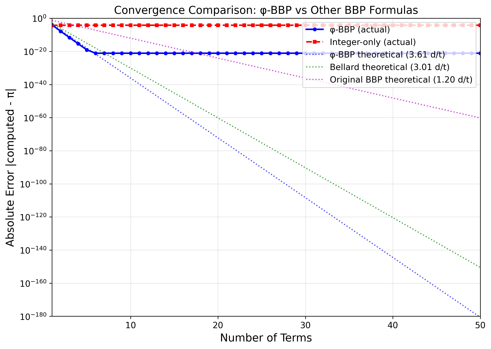
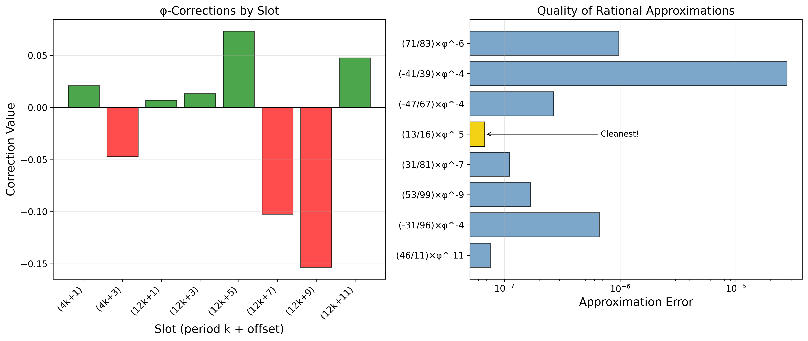
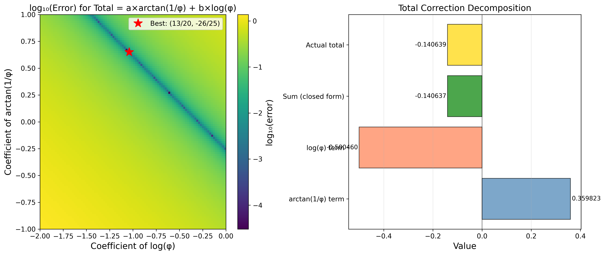
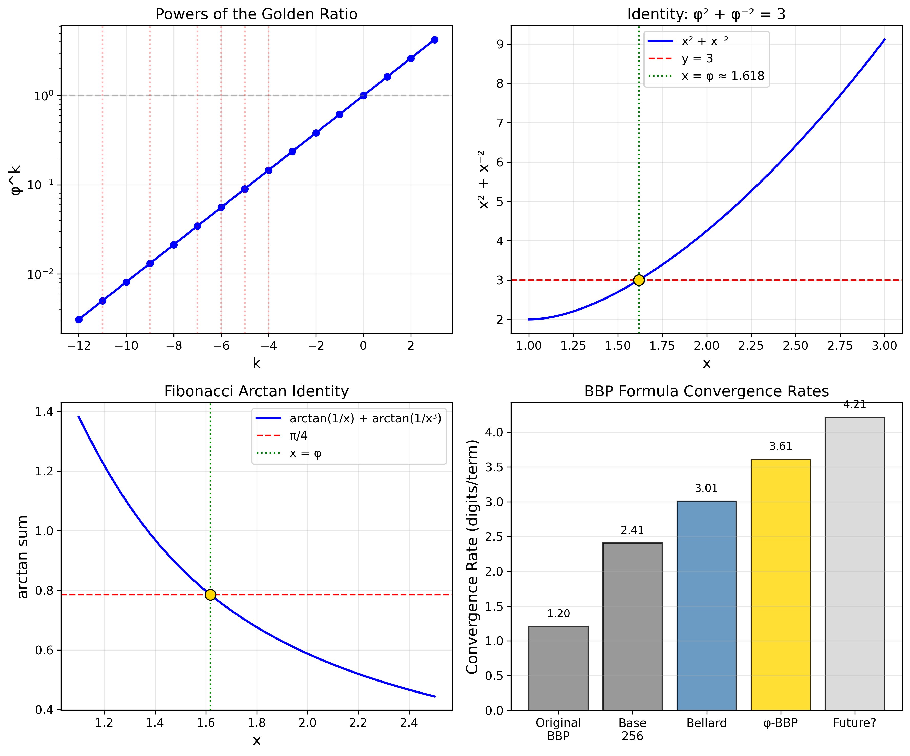

# The φ-BBP Formula Paper

This directory contains the research paper and supporting materials for our discovery of a new class of BBP-type formulas for π incorporating the golden ratio.

## Contents

- **[phi_bbp_formula.md](phi_bbp_formula.md)** - The main paper in Markdown format
- **[verify_formula.py](verify_formula.py)** - Verification script for all claims
- **[generate_figures.py](generate_figures.py)** - Figure and table generation
- **figures/** - Generated figures and tables

## Quick Start

```bash
# Verify all claims in the paper
python verify_formula.py

# Generate figures
python generate_figures.py
```

## Key Results

| Metric | Value |
|--------|-------|
| **Error** | 7.85 × 10⁻²² |
| **Convergence** | 3.61 digits/term |
| **vs Bellard** | 20% faster |

## The Formula

```
π = (1/64) × Σ (-1)^k/4096^k × [
    (256 + c₀)/(4k+1) + (-32 + c₁)/(4k+3) + 
    (4 + c₂)/(12k+1) + (1 + c₃)/(12k+3) +
    (-128 + c₄)/(12k+5) + (-64 + c₅)/(12k+7) +
    (-128 + c₆)/(12k+9) + (4 + c₇)/(12k+11)
]
```

where each correction cᵢ = (nᵢ/dᵢ) × φ^(-kᵢ) for some integers.

## Figures

### Convergence Analysis


### Golden Ratio Corrections


### Closed Form Structure


### Formula Structure


## Citation

If you use this work, please cite:

```bibtex
@article{gushurst2025phibbp,
  title={The φ-BBP Formula: A New Class of Spigot Algorithms for π 
         Incorporating the Golden Ratio},
  author={Gushurst, Lesley},
  year={2025},
  url={https://github.com/lostdemeter/phi_bbp}
}
```

## License

GNU General Public License v3.0 - see [LICENSE](LICENSE) for details.
